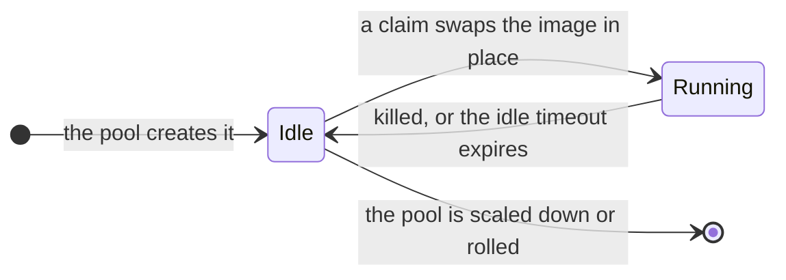

# In-place update

An in-place update is how a claim is served. A
[pool](/docs/concepts/pools) holds Pods that already exist and already run a
runtime; a claim swaps the container image on one of them instead of
scheduling anything new. It is the mechanism behind the platform's start
latency, and behind "run any image without building a template".

## The life of a Pod

The same three states, in the order they matter:

<Steps>
<Step>
**Idle — the Pod runs the template's `idleImage`.** That is the sandbox runtime
sitting in front of no workload, which is what makes it cheap to keep Pods
around: twenty idle Pods are not twenty copies of your image.
</Step>
<Step>
**Claim — the image is swapped in place.** The platform picks an idle Pod and
replaces the main container's image with the one the create asked for.
Kubernetes restarts that container on the same Pod: no scheduling, no new Pod,
no volume re-attach.
</Step>
<Step>
**Running — your process starts**, and the sandbox is handed to the caller.
</Step>
<Step>
**Return — the Pod goes back to idle.** When the sandbox is killed or times
out, the container is restarted onto the idle image and the previous sandbox's
metadata is cleared, so the next claim does not inherit it.
</Step>
</Steps>

## What that buys, and what it costs

| Buys | Costs |
|---|---|
| a claim does not wait for a scheduler, a node, or a volume | the container image still has to be pulled — first claim for a large image is slower |
| any image, no per-workload build | Pods cannot change *shape*: requests, limits, volumes and sidecars are fixed for the Pod's life |
| idle Pods are cheap, so pools can be deep | the image is chosen per claim, so two sandboxes from one pool may run different images |

The practical consequences:

- **Sizing is a pool decision, not a claim decision.** A different resource
  shape is a different pool, never a resized Pod.
- **The image is resolved when you claim.** Edit the env's or template's image
  and the next claim uses it. Nothing is rebuilt, and nothing that is already
  running is disturbed — see [templates](/docs/concepts/templates).
- **Warm Pods make claims fast; images make them slower.** If first-claim
  latency matters, that is an image-size question, and the pools holding that
  image's shape are the ones worth keeping warm.

## Three timeouts, three different things

| Timeout | Counts | Where it is set |
|---|---|---|
| **Startup** | from the claim to the sandbox being ready — dominated by the image pull | the env's/template's default, or `agentbox.scitix.ai/startup-timeout` on the create |
| **Idle** | from the last activity to the sandbox being reclaimed | `timeout=` on the create, `sbx.set_timeout(…)` to extend, the env's default otherwise |
| **Pod lifetime** | not a user-facing timeout; a Pod is recycled by rollouts and by the pool | — |

## Rolling is not the same thing

An in-place update changes one Pod's image to serve one claim. A **roll** is
the platform replacing idle Pods because the Pod's identity changed — the idle
image, the Pod body, the gateway, or the template's metadata. Rolls are
governed by the env's `updateStrategy` (`autoUpdate`, `maxUnavailable`) and can
be watched on a pool as `updateRevision`/`updatedReplicas`, with Pods counting
through `startingReplicas` and `stoppingReplicas`.

The running image is deliberately excluded from that identity, which is why a
roll is not triggered by changing the workload image.

## See also

- [Pools](/docs/concepts/pools) — where the Pods are
- [Templates](/docs/concepts/templates) — idle image and defaults
- [E2B Python SDK](/docs/tutorials/e2b) — `timeout`, `set_timeout`, `kill`
