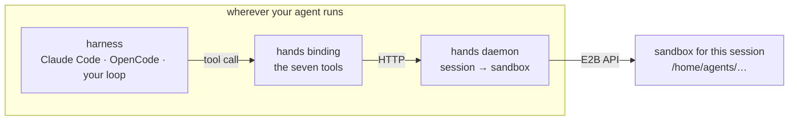

An agent harness has two jobs: decide what to do, and do it. The first is a
model loop with your prompt and your tools. The second is `bash`, `read`,
`write`, `edit`, `grep`, `glob`, `apply_patch` — and today it happens on
whatever machine the harness is running on.

**Brain and Hands** separates those two. The brain keeps running wherever you
run it; the hands become a sandbox bound to the conversation.



## Why the split is worth it

| Without it | With it |
|---|---|
| the work lands in someone's home directory and stays there | it lands in a sandbox that is reclaimed on a timer |
| a restarted process loses its scratch space | the sandbox is bound to the conversation, not the process |
| the agent's `rm -rf` is aimed at the machine you develop on | it is aimed at a machine that exists for this task |
| the filesystem is invisible unless you go and look | it is inspectable: the same sandbox is a page in the console |

<Callout title="This is confinement, not a security boundary" type="warn">
The agent process still runs on your machine, with your files, your environment
and your credentials. What moves into the sandbox is where the agent's *tools*
act. An agent that can install a package or load a plugin can reach the host
again — cooperative confinement, not isolation. If you need the stronger thing,
run the harness itself in a container or a sandbox; the two compose, and
[E2B Kata](/docs/examples/templates/e2b-kata) is how you get the sandbox half
to carry its own kernel.
</Callout>

## Three layers, and the rule that holds them together

`sdk/hands/` is one package with a deliberate seam:

| Layer | Path | What it does |
|---|---|---|
| **core** | `typescript/src/core/` | the seven tools and their behaviour contract — harness-neutral, knows nothing about harnesses |
| **binding** | `typescript/src/harness/{claude-code,opencode,mcp}/` | expresses "replace these built-ins with these tools" in one harness's vocabulary |
| **daemon** | `python/agentbox_hands/` | binds a stable session id to a sandbox, and serves the workspace file API |

The rule: **a binding must not reimplement behaviour from core.** A binding that
does drifts from the contract, and the drift is invisible from the signatures.

How completely the built-ins can be *taken away* differs by harness, and it is
worth knowing which one you are on before trusting the confinement:

| Harness | Mechanism | How complete |
|---|---|---|
| Claude Code | `tools: []` + `disallowedTools` + `mcpServers` + `toolAliases`, together | complete; subagents inherit it, and a test drives a real session to check |
| OpenCode | a tool whose name matches a built-in replaces it | **unverified** — the override appears to register alongside the built-in |
| Anything over MCP | the generic binding | MCP can *add* tools; it cannot remove a harness's built-ins |

That second row is the reason the console's own assistant runs on Claude Code:
an override that registers alongside the built-in leaves the built-in in play,
which is the one outcome this package exists to prevent.

## Plugging it in

<Tabs items={['Claude Agent SDK', 'OpenCode', 'Any agent, over MCP']}>
<Tab value="Claude Agent SDK">

```ts
import { sandboxToolOptions } from '@scitix/agentbox-hands/claude-code'

for await (const msg of query({
  prompt,
  options: { ...sandboxToolOptions({ sessionKey: threadId }) },
})) { … }
```

`sandboxToolOptions` returns all five tool-related options as one object on
purpose: applying four of five loses the guarantee and nothing complains.

</Tab>
<Tab value="OpenCode">

Point the config directory's `tools/<name>.ts` at the binding — one line each,
and the filename is what does the overriding:

```ts
// ~/.config/opencode/tools/bash.ts
export { default } from '@scitix/agentbox-hands/opencode/tools/bash'
```

Raise `tool_output` in `opencode.json` at the same time, or the confinement
leaks: OpenCode truncates an oversized tool result by writing the full text to a
file on the machine running the harness and handing the agent that path. The
binding's own offload writes into the sandbox instead, and needs the limit out
of the way.

</Tab>
<Tab value="Any agent, over MCP">

```ts
import { createServer } from 'node:http'
import { handsMcpHttpHandler } from '@scitix/agentbox-hands/mcp/http'

createServer(handsMcpHttpHandler()).listen(8766)
```

Every request must carry the conversation's own stable id in `X-Hands-Session`.
The MCP transport's session id looks right and is not: it changes on reconnect
(the conversation quietly moves to a new sandbox) and is shared when one
connection serves several conversations (they end up on one filesystem).

</Tab>
</Tabs>

## Where the code is

The package is in [`sdk/hands/`](https://github.com/scitix/Agent-Sandbox/tree/develop/sdk/hands),
with Claude Agent SDK, OpenCode and MCP bindings and its own README — which is
more precise about the open questions than this page can be.

**The platform's own assistant is the reference implementation**, and it runs
this architecture end to end: the console's floating assistant is a brain in
the browser, a gateway, and a sandbox per conversation.

| Piece | Where |
|---|---|
| The brain's instructions | [`brain/AGENTS.md`](https://github.com/scitix/Agent-Sandbox/blob/develop/brain/AGENTS.md) — the prompt a sandbox-backed agent runs with |
| The gateway that drives the harness | [`brain/gateway/`](https://github.com/scitix/Agent-Sandbox/tree/develop/brain/gateway) |
| The conversation UI and its tool cards | [`dashboard/components/assistant-ui/`](https://github.com/scitix/Agent-Sandbox/tree/develop/dashboard/components/assistant-ui) |
| The session → sandbox binding | [`sdk/hands/python/agentbox_hands/`](https://github.com/scitix/Agent-Sandbox/tree/develop/sdk/hands/python/agentbox_hands) |
| The pool its sandboxes come from | [`installer/helm/agent-sandbox-hub/values.yaml`](https://github.com/scitix/Agent-Sandbox/blob/develop/installer/helm/agent-sandbox-hub/values.yaml) — `assistant.sandbox` names the Env and the image |

Reading those five together is the shortest path from "I have a harness" to "my
harness's tools act on a sandbox": the prompt shows what the brain is told, the
gateway shows the loop, and the hands package shows the tool layer underneath.

## The patterns behind it

The split is not ours to invent — it is where the ecosystem has been heading,
and these are the pieces worth reading alongside it:

- **OpenAI, [Agents SDK](https://openai.github.io/openai-agents-python/)** —
  agents as a loop with tools, handoffs and guardrails.
- **Anthropic, [Building effective agents](https://www.anthropic.com/engineering/building-effective-agents)** —
  when a workflow beats an agent, and why tools are the interface.
- **Anthropic, [Writing effective tools for agents](https://www.anthropic.com/engineering/writing-tools-for-agents)** —
  tool shape is prompt engineering; the seven tools here are the result of that
  thinking applied to a filesystem and a shell.
- **Anthropic, [Code execution with MCP](https://www.anthropic.com/engineering/code-execution-with-mcp)** —
  the argument for putting tool execution *somewhere else* rather than in the
  agent's own process, which is the premise of this page.
- **[Claude Agent SDK](https://docs.claude.com/en/api/agent-sdk/overview)** and
  **[Model Context Protocol](https://modelcontextprotocol.io/)** — the two
  integration surfaces the bindings target.

## See also

- [`abx-managed-agent`](/docs/skills/abx-managed-agent) — the same material written for an agent
- [E2B Python SDK](/docs/tutorials/e2b) — how a sandbox is created, which is what the daemon does
- [In-place update](/docs/concepts/inplace-update) — why handing a session its own sandbox is cheap
