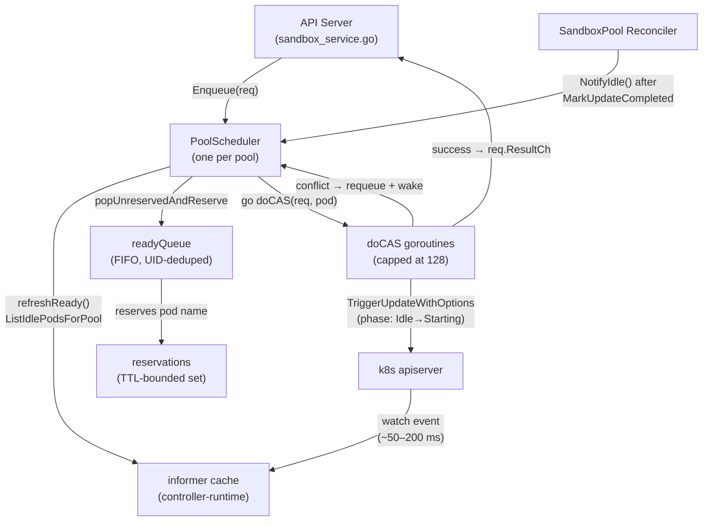
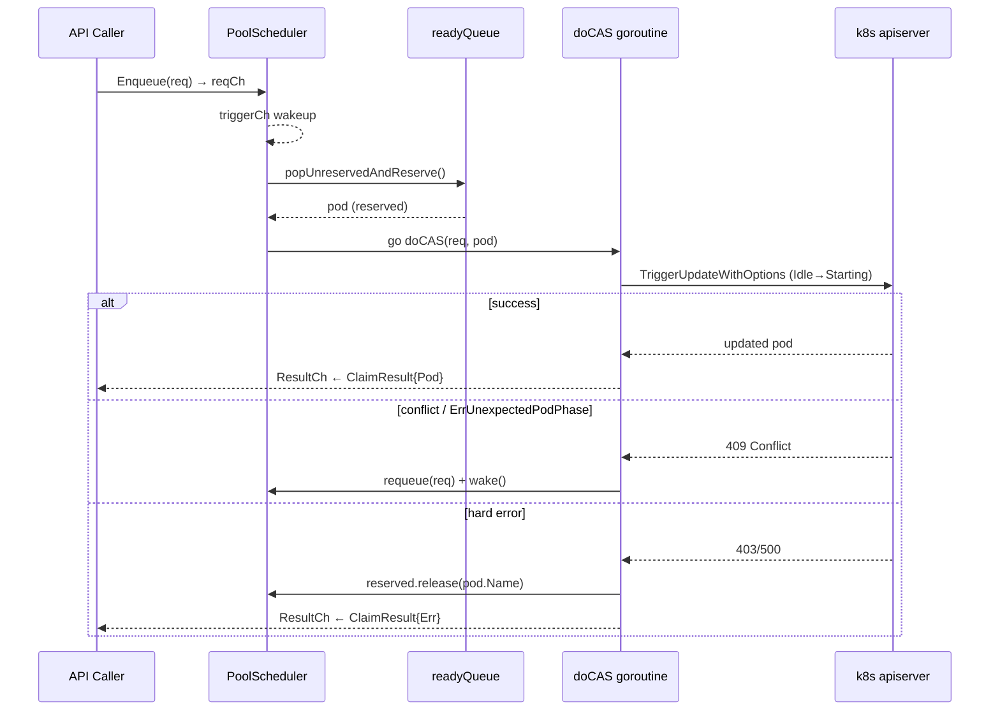
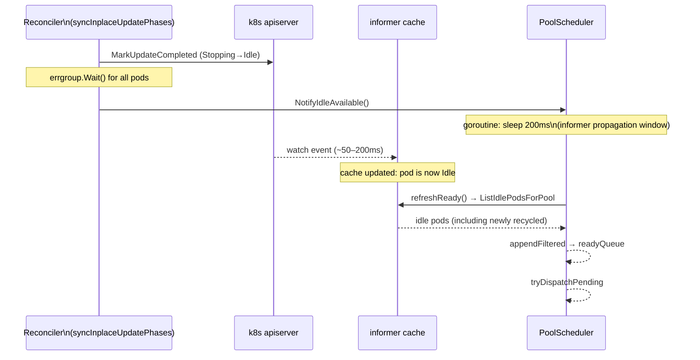

# Package `schedule` — Per-Pool Streaming Claim Scheduler

This package implements the claim scheduler that pairs incoming sandbox-create requests with idle pods in a SandboxPool. Each pool gets one `PoolScheduler` instance running a dedicated goroutine.

---

## Architecture

### Component Overview



### Data Flow: Request Lifecycle



### Idle Pod Notification Flow



The 200 ms delay in `NotifyIdle` is deliberate: firing `refreshReady` before the watch event arrives returns a stale cache view where the just-recycled pod still appears as Stopping, causing the scheduler to fall back to the 10-second poll timer.

---

## Key Design Decisions

### FIFO readyQueue + UID dedup

Pods enter the queue in the order `refreshReady` first observes them as Idle. Because `NotifyIdle` fires on every Stopping→Idle transition, the earliest-recycled pod is always dispatched first — equivalent to "prefer older idle" semantics without a scorer.

Duplicate entries are prevented by a UID set: repeated `refreshReady` calls (e.g. from both `idleCh` and `pollTimer`) do not double-admit the same pod.

### TTL-bounded reservations

When a pod is handed to a `doCAS` goroutine it is atomically reserved (pod name → expiry). Subsequent `ListIdlePodsForPool` calls from the informer cache may still report that pod as Idle for up to ~300 ms (watch propagation latency). The reservation prevents re-selecting it during that window, eliminating `ErrUnexpectedPodPhase` conflicts under high QPS.

TTL (`reservationTTL = 2 s`) is long enough to outlast any realistic informer lag but far shorter than the time a pod takes to legitimately return to Idle again (tens of seconds minimum).

### Non-blocking scheduler goroutine

`doCAS` always runs in a fresh goroutine; the scheduler loop never blocks on apiserver round-trips. This keeps request latency proportional to the number of idle pods, not the number of concurrent requests.

### Exponential back-off + immediate wakeup

When no idle pods are available, `pollTimer` backs off exponentially (10 s → 5 min). Any of three events immediately resets the interval to 10 s and triggers a dispatch attempt:

- **New request arrives** → `triggerCh`
- **Pod becomes Idle** → `idleCh` (delayed by `idleNotifyDelay`)
- **CAS conflict** → `triggerCh` via `wake()`

### Scale-up signal

When requests are pending and the ready queue is empty, `triggerScaleUpOnce` writes `PoolScaleUpPendingAnnotationKey` onto the SandboxPool. A `singleflight` guard deduplicates concurrent calls so a burst of arrivals does not cause an annotation storm. The Reconciler's autoscaler observes this annotation and increases `spec.replicas`.

---

## Running Stress Tests

Stress tests live in `scheduler_stress_test.go` and are gated behind the `stress` build tag so they never run during normal `go test ./...`.

```bash
# Baseline run
SCHEDULE_STRESS_SCALE=1.0 go test -race -count=1 -tags=stress ./pkg/lifecycle/schedule/...

# Heavier load (2× requests, pods, and durations)
SCHEDULE_STRESS_SCALE=2.0 go test -v -race -count=3 -tags=stress ./pkg/lifecycle/schedule/...

# Quick smoke run (half load)
SCHEDULE_STRESS_SCALE=0.5 go test -race -count=1 -tags=stress ./pkg/lifecycle/schedule/...
```

### `SCHEDULE_STRESS_SCALE`

A positive floating-point multiplier (default `1.0`) applied to request counts, pod counts, and test durations. Scaling above `1.0` increases the chance of catching rare race conditions; scaling below `1.0` speeds up CI smoke runs.

### Test Coverage

| Test | What it checks |
|------|---------------|
| `TestScheduler_ExtremeScale` | 2000 concurrent requests against 500 pods; every pod dispatched exactly once; every request terminates |
| `TestScheduler_ConflictInjectionUnderLoad` | ~30% of pods inject a retriable Conflict on first attempt; scheduler retries and still claims all pods |
| `TestScheduler_StressStorm` | Continuous enqueue + `NotifyIdle` storm for 600 ms; `Shutdown()` returns within 5 s |
| `TestScheduler_ConcurrentEnqueueAndShutdown` | Concurrent `Enqueue` callers while `Shutdown` is called; neither hangs |

The `-race` flag is the authoritative correctness signal. The stress tests intentionally do not assert on goroutine counts: parallel test processes inflate `runtime.NumGoroutine()` independent of real leaks.
